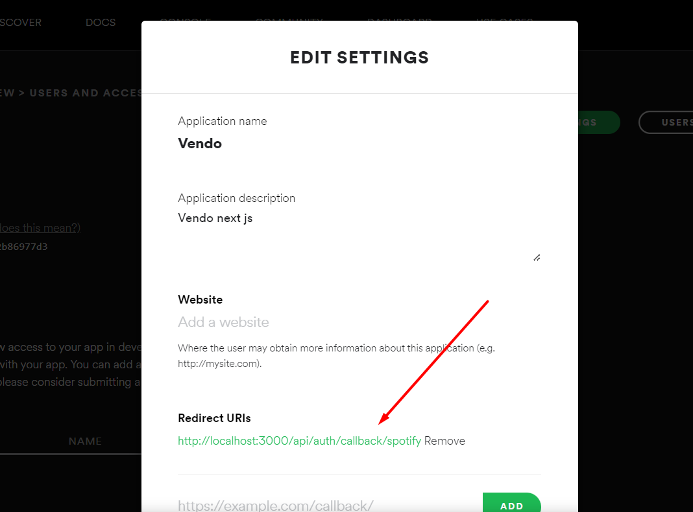
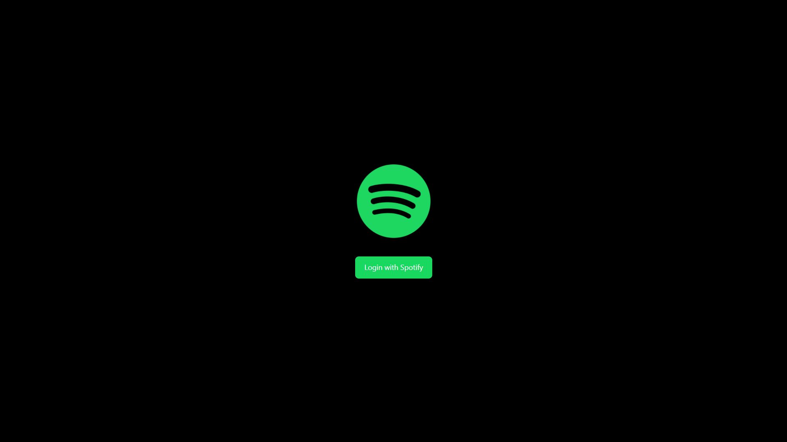
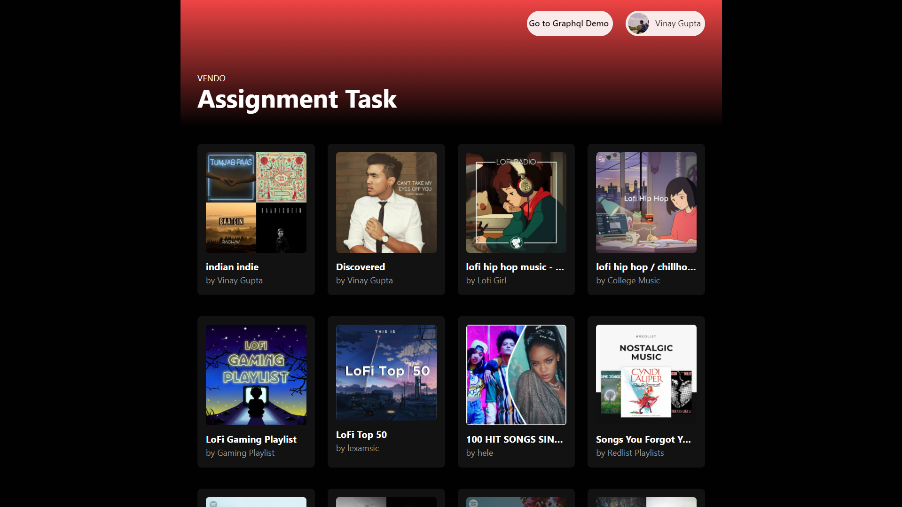
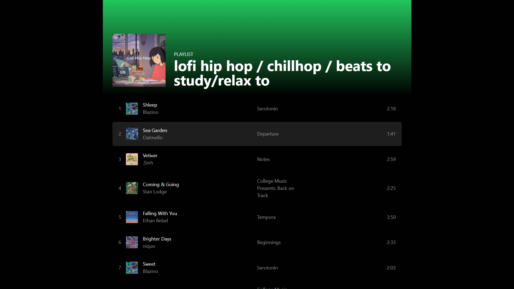
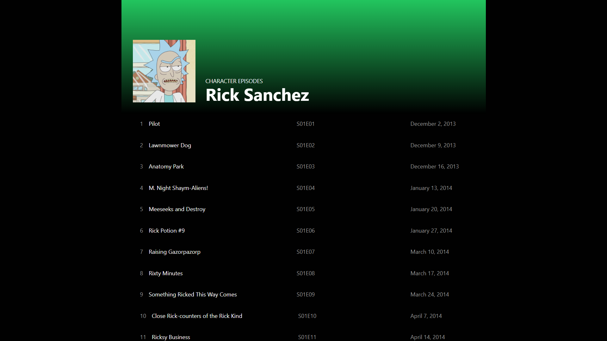

# Vendo Assigment

## How to use locally

Rename the .env.example file to .env

Replace the correct values of the following:

```bash
CLIENT_ID
CLIENT_SECRET
JWT_SECRET
```

Add the your localhost Redirect URI in your app settings in Spotify Dashboard.

```bash
http://localhost:3000/api/auth/callback/spotify
```



Install npm dependencies

```bash
npm install
```

Start the project

```bash
npm run dev
```

## Some Screenshots










